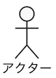

##  ユースケース分析
静的分析であるドメイン分析が(たたき台ベースで)終わったら、次にユースケース分析に入ります。ユースケース分析とはシステムの利用者(アクター)とシステムとの利用局面を洗い出すことで、システムに求められる**機能要件**を洗い出すものです。

また、利用者とシステムとの接点が判明するので局面毎の非機能要件を定義することもできます。例えばアクター(システム管理者)の画面操作は日に何十回と行われ、秒単位で応答する必要があるが、アクター(バッチタイマー)からのデータ操作は日に1度しか行われず、1時間以内に終われば良い…といった形です。

### アクター分析
アクターとは外部から**ユースケースに働きかける存在**で ユースケース図の上では **人型(スティックマン)** で表現されます。表現上では人の様ですが、先の例の様に必ずしも人とは限らず 関連システムである場合もあります。要するにアクターの本質は単に外部からシステムに働きかける **役割** に過ぎません。

#### 観点と抽象度

アクター分析で難しいのは、同じ人やシステムをどの観点から捉えるかという点です。同じ人間でも、男性、会社員、営業部長、人事評価者、スポーツクラブ会員、有権者、普通免許所持者、等の色々な側面（**役割**）を持つからです。大事なのは次の2点です。
- **どの観点から** アクターを見るか
- **どの抽象度で** アクターを表現するか

例えば、システムが営業部で利用しているCRM(顧客関係管理)であれば、アクター名に**営業部長**が出てきても不自然には見えません。しかし実際にシステムに対して行っているのが横断的なクレーム履歴の閲覧だけだったとしたら、営業部長の役割は**クレーム履歴閲覧者**かも知れません。社員の観点からは営業部長に見えた人も、システムの観点からみるとクレーム履歴閲覧者に見えてくる訳です。(観点の調整)

しかし現時点で実際に行っていることがクレーム履歴の閲覧だけでも、本来任されているのは閲覧作業だけではなく「クレーム対応を責任を持って行うこと」なのだとしたら、アクターの名称は**クレーム対応責任者**が適当でしょう。(抽象度の調整)

ここでは「大まかな観点の抽出」→「システム視点での具象化」→「役割視点での抽象化」」という順にアクターを分析してゆきましたが、どの順番に分析するかは自由です。大事なのは**ファーストアイデアに飛びつかず、常に改善の余地を探る**ことです。

> 写真撮影や絵画の構図は、視点やピントの捉え方が重要で、これをミスするとメッセージ性に強く影響しますが、アクターにおける観点と抽象度もそれと似ています。軽視しても作品(分析)自体は完成するものの、高い確率で駄作となってしまうのです。

- 自分が分析対象のシステムになったつもりでアクターを見ると、アクターはどの役割に見えますか？
- アクターの抽象度を上げたり下げたりして名称を変えてください。どの名称が一番しっくりきますか？
  - (重要な抽象度が複数ある場合は、複数のアクターに継承関係を持たせて定義するのが良いかも知れません)

### ユースケース分析
アクターの分析が完了したらユースケースの分析を行います。ユースケースは楕円の中にアクターが行う行動を記載します。アクターを主語として「(目的語)を(動詞)する」という書き方にすると描写が明確になるでしょう。目的語を明示すると、後の工程で処理すべき情報(エンティティ)を明確にする効果があります。エンティティの詳細はロバストネス分析の時に説明するとして、ここでは「処理対象の情報を明確にしておくと後の分析が捗る」くらいに捉えておきます。
