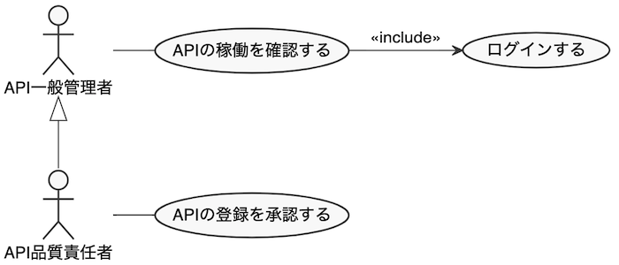

##  ユースケース分析
静的分析であるドメイン分析が(たたき台ベースで)終わったら、次にユースケース分析に入ります。ユースケース分析とはシステムの利用者(アクター)とシステムとの利用局面を洗い出すことで、システムに求められる**機能要件**を洗い出すものです。

また、利用者とシステムとの接点が判明するので局面毎の非機能要件を定義することもできます。例えばアクター(システム管理者)の画面操作は日に何十回と行われ、秒単位で応答する必要があるが、アクター(バッチタイマー)からのデータ操作は日に1度しか行われず、1時間以内に終われば良い…といった形です。

### アクター分析
アクターとは外部から**ユースケースに働きかける存在**で ユースケース図の上では **人型(スティックマン)** で表現されます。表現上では人の様ですが、先の例の様に必ずしも人とは限らず 関連システムである場合もあります。要するにアクターの本質は単に外部からシステムに働きかける **役割** に過ぎません。

#### アクターの観点と抽象度

アクター分析で難しいのは、同じ人やシステムをどの観点から捉えるかという点です。同じ人間でも、男性、会社員、営業部長、人事評価者、スポーツクラブ会員、有権者、普通免許所持者、等の色々な側面（**役割**）を持つからです。大事なのは次の2点です。
- **どの観点から** アクターを見るか
- **どの抽象度で** アクターを表現するか

> [シナリオ]  
> 
> 例えば、100を超える各種APIを管理するシステムを運用している部署「API管理部」があるとします。この部では社内外に公開されるAPIを管理しており、マイクロサービス毎にグルーピングされたAPIを登録・管理しています。管理下に置かれたAPIは、API毎のアクセス量やサービスレベルの計測、認可機能の付与やAPI仕様書の公開、といった汎用サービスを受けられるものとします。

さて、このシナリオのアクターとして「**API管理部長**」が登場したとします。これは特に不思議ではありません。しかし、この部長が実際に行っているのが「API登録時の承認作業」だけだとしたら「**API登録承認者**」の方が適切な名前かも知れません。(観点の調整)

ところが別の事実が判明し、現時点での実業務はAPI登録時の承認作業だけですが、本来任されているのはAPIの品質管理全般だとしたら「**API品質責任者**」が妥当な名前でしょう。(抽象度の調整)

ここでは「大まかな観点の抽出」→「システム視点での具象化」→「役割視点での抽象化」」の順にアクターを分析してゆきました。実際にどのような順番で分析するかは分析者の自由です。大事なのは**ファーストアイデアに飛びつかず、常に改善の余地を探る**ことです。

> [観点や抽象度の重要さ]
> 
> 写真撮影や絵画の世界では、視点(構図)や焦点(ピント)が非常に重要です。アクターにおける観点と抽象度もそれと比較すると分かりやすいかも知れません。軽視しても一応の作品(分析)は出来るものの、名作には成り得ないという点も似ているような気がします。

自分で定義したアクターに満足いかない場合は、以下の質問に答えてみると何かが見えるかも知れません。

- 自分が分析対象のシステムになったつもりでアクターを見ると、アクターはどの役割に見えますか？
- アクターの抽象度を上げたり下げたりして名称を変えてください。どの名称が一番しっくりきますか？

#### アクターの汎化
ドメイン分析には汎化という関連がありましたが、アクターの世界にも汎化は存在します。汎化は無理して抽出する必要もありませんが、汎化関係を明示したほうが役割の階層が理解しやすくなるケースもあり、その場合は汎化を表現することをおすすめします。

例えば、先のアクターとして登場した「**API品質責任者**」ですが、この役割の人でなくとも「API管理部」の人間であれば誰でもAPI管理システムにログインし、API稼働状況の確認が出来るとします。仮にこの役割を「**API一般管理者**」とします。更にAPI品質責任者がAPI一般管理者の役割を含むのであれば、両者には汎化(継承)関係がありそうです。

これを検証するには「API品質責任者がAPI一般管理者として振る舞うことが可能か」を確かめてみて下さい。可能であれば関係の関係が成立していると言えそうです。

### ユースケース分析
アクターの分析が完了したらユースケースの分析を行います。ユースケースは楕円の中にアクターの行動を記述して表現します。アクターを(主語)として「**(目的語)を(動詞)する**」という書き方にすると描写が明確になります(*1)。

表現方法として「〜することができる (Can)」「〜する可能性がある (May)」といった**助動詞**を含む書きっぷりもありますが、こうすると一見 正確なようで助動詞部分に曖昧さが残ります。これが結構なデメリットとなるのでこの様な表現は控えた方が良いです。ユースケースとして存在するのかしないのかを確認し、存在するならはっきりと言い切る様にしましょう。

> *1) 目的語を明示すると後の工程で処理すべき情報(エンティティ)を明確にする効果があります。エンティティの詳細はロバストネス分析の際に説明しますが、ここでは処理対象の情報 (エンティティ) を明確にしておくと後の分析が楽になる」くらいに捉えてください。

#### 目的で書くか、手段で書くか
ユースケースの書きっぷりには大きく2種類あります。それは目的でユースケースを書くか、手段でユースケースを書くかです。

例えば、先のユースケース「APIの稼働を確認する」を例にとります。APIの稼働を確認するというのは最終的な目的です。当然何を意図しているのかは分かりますが、一方で具体的な作業内容は分かりません。そして具体的な作業内容が分からなければシステムも設計しづらいでしょう。

一方で「APIのモニタリングページを閲覧する」というユースケースであれば、具体的な作業内容は分かります。しかし今度は目的が少し曖昧になってしまいます。モニタリングページを閲覧する目的はAPIの稼働確認ではなく性能確認かも知れません。目的が分からなければシステム化により何をしたかったのかが曖昧になり、その達成度も測れないでしょう。

では一体どうすれば良いのか。一つの答えは両方を書くことです。両方を書くとゴチャゴチャしそうですが、整理して書けば決してそうはなりません。整理して可視化できるところがUMLの長所ですので、これを活用しない手はありません。

#### 関連線の詳細化

#### システム境界の明示

#### ユースケース記述

<!-- 要件定義ではなく詳細設計 -->
<!-- 紙芝居 -->

<!-- 何故APIのモデリングが重要なのか => 人間の扱う画面とちがって変更出来ないから -->
